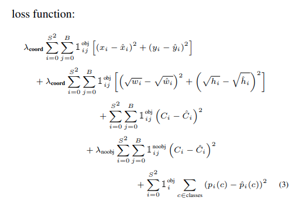

## 算法与数据结构

- [x] Data Structure
  - [x] Linear Data Structure
  - [x] Linked List Data Structure
  - [x] Hash
  - [x] Tree
  - [ ] Graph
- [x] Algorithm
  - [x] Linear Search
  - [x] Binary Search
- [x] Sort
  - [x] bubble Sort
  - [x] select Sort
  - [x] Insert Sort
  - [x] Shell Sort
  - [x] Merge Sort
  - [x] Quick Sort

## DEEP LEARNING ON DETECTOR

- [ ] One stage
  - [ ] YOLO v1-v3
  - [ ] retianNet
- [ ] Two Satge
  - [ ] RCNN
  - [ ] Fast RCNN
  - [ ] Faster RCNN

#### YOLO-V1

算法概述

* yolo v1是一个一阶段算法，该算法将目标检测问题看作是一种回归问题，这个算法将目标检测和分类任务融合到了一起，只需要一次前向传播就能输出检测目标的位置信息和每个类别的概率。yolo v1采用了24个卷积层进行特征提取，后接两个全连接层进行坐标回归和分类输出。论文中强调，该网络使用了**整个图像的特征**进行目标检测，这是和二阶段算法一个非常不一样的地方，当时的二阶段算法还是基于Region propose进行边界框的微调和分类的，因此当时的二阶段算法在进行计算时，是基于原图中的一小块图像（Region propose）进行分类和检测的。这就导致二阶段算法丢失全目标在全图上的信息。

网络结构

* 24个卷积层 + 2个全连接层
* 卷积层中使用的1x1卷积有什么作用？
  * 原论文中有这样一句话：交互式1x1卷积能够从前面的层中减少特征空间。这个特性应该是在1x1和3x3卷积重复的块中的体现出来的，每个3x3卷积后立马通过1x1降维。
  * 有人说可以增加非线性，正确的理解应该是在1x1卷积后面的激活函数可以增加非线性，如果没有激活函数，1x1卷积是不会增加非线性的。

模型的输入、输出

* 输入：448x448
* 输出：5x2+classification
* confidence = IOU

Loss函数

* 所有的Loss计算方式都使用了平方和误差
* $x_i，y_i$ 表示了锚框的中心点相对于当前网格的位置，因此 x y 的取值范围是0-1的
* $w_i， h_i$表示锚框的长、宽，这也是一个相对值，相对于图片宽高的值，因此w h 的取值范围也是0-1，为了使 **大锚框计算输出的误差相对于小锚框是一个样的**，这里使用了平方根的方式放缩了锚框，但在实际的训练效果上并没有体现出来很大的提升。
* 为了平衡location error 和 classification error对 total error的影响，引入参数$\lambda_{coord}=5,\lambda_{noobj}=0.5$

优点

* 快 精度还不错

缺点

* 没有使用BN
* 对小目标检测效果不好
* 对拥挤情况效果不好
  * 每个格子只能检测一个目标
* 对形状变换大的物体检测效果不好
  * 当同一个场景中同时存在非常大和非常小的目标需要检测时，这个时候YOLO V1的检测效果就不太好了。虽然在Loss设计中考虑到了这一点，但是对W H开平方根的方式并没有从根本上解决这个问题。
  * 解决这个问题的办法：在多尺度的特征图进行检测，让模型输出多个特征层，每个特征层在原图的感受野是不同的，我们就假定认为大的物体落在小的特征图上，小的物体位于大的特征图上，以此方式分配锚框。

#### YOLO-V2

* Loss function中的预测值就是模型的输出值
* 为什么模型不能直接输出$x_p, y_p, w_p, h_P$, 然后再用这些值去算呢？
  * 直接定义模型的输出就是offset，然后使用偏移量去计算真正的预测结果
* encode
* deconde

#### YOLO-V3

