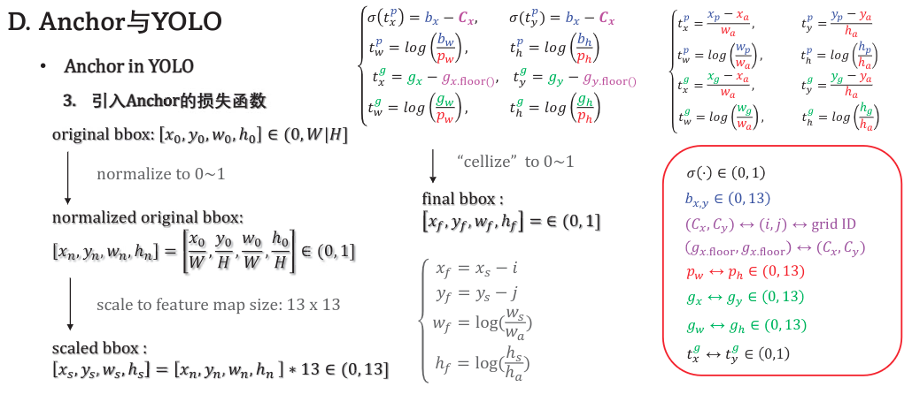

## 算法与数据结构

- [x] Data Structure
  - [x] Linear Data Structure
  - [x] Linked List Data Structure
  - [x] Hash
  - [x] Tree
  - [ ] Graph
- [x] Algorithm
  - [x] Linear Search
  - [x] Binary Search
- [x] Sort
  - [x] bubble Sort
  - [x] select Sort
  - [x] Insert Sort
  - [x] Shell Sort
  - [x] Merge Sort
  - [x] Quick Sort

## DEEP LEARNING ON DETECTOR

- [ ] One stage
  - [ ] YOLO v1-v3
  - [ ] retianNet
- [ ] Two Satge
  - [ ] RCNN
  - [ ] Fast RCNN
  - [ ] Faster RCNN

#### YOLO-V1

##### 算法概述

* yolo v1是一个一阶段算法，该算法将目标检测问题看作是一种回归问题，这个算法将目标检测和分类任务融合到了一起，只需要一次前向传播就能输出检测目标的位置信息和每个类别的概率。yolo v1采用了24个卷积层进行特征提取，后接两个全连接层进行坐标回归和分类输出。论文中强调，该网络使用了**整个图像的特征**进行目标检测，这是和二阶段算法一个非常不一样的地方，当时的二阶段算法还是基于Region propose进行边界框的微调和分类的，因此当时的二阶段算法在进行计算时，是基于原图中的一小块图像（Region propose）进行分类和检测的。这就导致二阶段算法丢失全目标在全图上的信息。

##### 网络结构

* 24个卷积层 + 2个全连接层
* 卷积层中使用的1x1卷积有什么作用？
  * 原论文中有这样一句话：交互式1x1卷积能够从前面的层中减少特征空间。这个特性应该是在1x1和3x3卷积重复的块中的体现出来的，每个3x3卷积后立马通过1x1降维。
  * 有人说可以增加非线性，正确的理解应该是在1x1卷积后面的激活函数可以增加非线性，如果没有激活函数，1x1卷积是不会增加非线性的。

##### 模型的输入、输出

* 输入：448x448
* 输出：5x2+classification
* confidence = IOU

##### Loss函数

* 所有的Loss计算方式都使用了平方和误差
* $x_i，y_i$ 表示了锚框的中心点相对于当前网格的位置，因此 x y 的取值范围是0-1的
* $w_i， h_i$表示锚框的长、宽，这也是一个相对值，相对于图片宽高的值，因此w h 的取值范围也是0-1，为了使 **大锚框计算输出的误差相对于小锚框是一个样的**，这里使用了平方根的方式放缩了锚框，但在实际的训练效果上并没有体现出来很大的提升。
* 为了平衡location error 和 classification error对 total error的影响，引入参数$\lambda_{coord}=5,\lambda_{noobj}=0.5$

优点

* 快 精度还不错

缺点

* 没有使用BN
* 对小目标检测效果不好
* 对拥挤情况效果不好
  * 每个格子只能检测一个目标
* 对形状变换大的物体检测效果不好
  * 当同一个场景中同时存在非常大和非常小的目标需要检测时，这个时候YOLO V1的检测效果就不太好了。虽然在Loss设计中考虑到了这一点，但是对W H开平方根的方式并没有从根本上解决这个问题。
  * 解决这个问题的办法：在多尺度的特征图进行检测，让模型输出多个特征层，每个特征层在原图的感受野是不同的，我们就假定认为大的物体落在小的特征图上，小的物体位于大的特征图上，以此方式分配锚框。

#### YOLO-V2

##### 概述

* YOLOV2是针对V1存在的问题进行了更新，技术上在每一层的后面都添加了**Batch Normalization**，有效的提升了模型的训练速度和精度。引入了**Anchor机制**也是为了解决在同一个场景中存在尺寸变化较大的目标。在结构上作者认为在模型的浅层（就是前几层）包含的是目标的纹理信息--是有利与做目标的检测任务，模型的深层更关注模型的语义信息--有助于做分类任务。所以在结构上模型增加了**passthrough layer**直接将浅层的数据经过一个“reorg层”的处理，concatnate到一起，这样在深**层就同时包含了位置信息和语义信息**。修改了Loss函数，让函数预测偏移量并**对$t_x,t_y$添加了激活函数的限制--更利于模型在训练初期的稳定性**。移**除了最后的两个全连接层和一个pooling层**，删除全连接层后模型可以接受多种分辨率的输入，移除最后一个pooling层后最后的特征图从原来的7x7 增长到了13x13，也是为了提高模型对小目标和密集目标的检测能力。在训练方面，因为移除了最后的全连接层，**使用了多尺度训练**，使得模型更加鲁棒。

##### 结构

* 移除了fully connected layer
* 增加了passthrough layer直接将浅层输出通过reorg层，拼接到深层输出中

##### 输入 输出

* 输入方面，支持多分辨率输入最小320x320，最大416x416
* 每个“锚点”上放置5个锚框，所以在输出中，输出5 * 5 + classification
* ($t_x, t_y, t_w, t_h$) 输出相对于锚框的偏移量和confidence

##### Loss函数

$$
Loss = (t^p_x - t^g_x)^2 + (t^p_y-t^g_y)^2+(t^p_w - t^g_w)^2 + (t^p_h - t^g_h)^2
$$

* 对 $t_x,t_y$增加了activation function的限制，对模型输出的预测值x,y进行了范围限制。论文中作者说这提升了模型在训练初期的稳定性。
* encode
  * 从标注数据计算$t^g_x, t^g_y, t^g_w, t^g_h$的过程称为encode
* decode
  * 从模型的输出到计算$b_x, b_y, b_w, b_h$的过程称为decode

##### 知识点

* 为什么模型不能直接输出$x_p, y_p, w_p, h_P$, 然后再用这些值去算呢？

  * 因为我们规定了模型的输出就是offset，然后使用偏移量去计算真正的预测结果。

* Batch Normalization
  $$
  Y = {X - \mu \over \sqrt{Var(X)+\epsilon}} \cdot \gamma + \beta
  $$

  * Motivation
    * 如果一个模型在训练过程中，模型在每个维度的梯度差异较大时，就会导致模型的训练不容易收敛。例如一个模型在训练过程中，如果每个输入维度的数据存在比较大的Scale的情况，这就会导致模型在每个维度上的更新梯度的斜率差异比较大，所以会导致模型不易收敛，不容易找到Loss的最低点。
    * 如何解决上面的问题呢？
    * 在模型每一层的输入前能够**将数据的每一维都进行标准化**，这样可以保证每一维输出的数据没有较大的差异。在深度学习中我们的数据是以batch进行训练的，因此每次的计算都是基于**Batch**计算的，也称为Batch Normalization。因此使用该方式训练中batch也不能太小。
    * $\gamma,\beta$是两个可学习参数，虽然我们在训练过程中对每个维度的数据进行了标准化（让模型的每个维度输出的数据在相同的范围内），但是如果模型在训练过程中认为某一维可能不应该是这个范围，所以添加了两个自动调节的参数来调整这一层的Batch的影响。

* K-Means

* 

#### YOLO-V3

